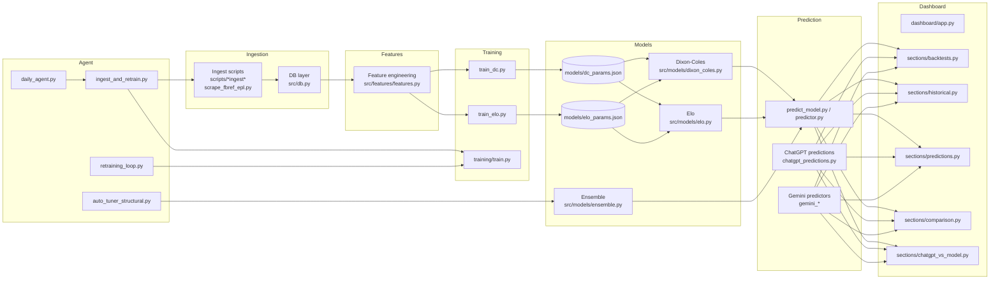

## Local Agentic EPL Soccer Prediction AI

This is a **self-contained, local** project for **English Premier League (EPL)** predictions.

- **Core models**: Dixon–Coles Poisson and Elo, plus an **ensemble** for win/draw/loss and goal expectations.
- **Agent layer**: automation for ingesting results, retraining, and auto-tuning parameters to make the system self-improving.
- **Dashboards & evaluation**: backtests, historical performance, and LLM-vs-model comparisons.

---

## Architecture Overview

At a high level, the system is organized into these layers:

- **Ingestion & storage**  
  - Scripts under `scripts/` fetch / ingest EPL results and fixtures into local storage and the DB (`src/db.py`).
- **Feature engineering**  
  - `src/features/features.py`, `src/features/utils.py` compute match-level and team-level features for training and prediction.
- **Models & training**  
  - Core models live in `src/models/` (Dixon–Coles, Elo, ensemble) with trainers such as `train_dc.py`, `train_elo.py`, and `training/train.py`.
  - Fitted parameters are stored in `models/dc_params.json`, `models/elo_params.json`, etc.
- **Prediction layer**  
  - `src/predict/predict_model.py` and `src/predictor.py` generate probabilities and expected goals from trained models.
  - Optional LLM-based predictors (ChatGPT / Gemini) live under `src/predict/` and `src/predict/gemini/`.
- **Agent orchestration**  
  - `src/orchestrator/cli.py`, `src/orchestrator/orchestrator.py`, `src/agent/ingest_and_retrain.py`, `src/agent/auto_tuner_structural.py`, and `scripts/agent/retraining_loop.py` orchestrate end-to-end runs and self-training.
- **Evaluation & dashboards**  
  - Evaluation scripts under `scripts/evaluation/` compute metrics and backtests.
  - `dashboard/app.py` and `dashboard/sections/*` expose performance, predictions, and comparisons via a local dashboard.

---

## System Diagram (Mermaid)

You can render this diagram in any Markdown viewer that supports **Mermaid** (e.g. GitHub, some IDEs, MkDocs, Obsidian):



---

## 1) Setup

```bash
cd soccer_agent_local
python -m venv .venv
# Windows: .venv\Scripts\activate
# macOS/Linux:
source .venv/bin/activate

pip install --upgrade pip
pip install -r requirements.txt
```

---

## 2) Run Predictions for Fixtures

1. Edit `data/raw/fixtures_today.csv` with the matches you want to predict.
2. Run the orchestrator CLI:

```bash
python -m src.orchestrator.cli --config config.yaml --fixtures data/raw/fixtures_today.csv
```

This prints a table and saves a CSV under `models/predictions/` like `predictions_YYYYMMDD_HHMMSS.csv`.

Columns include:

- `pH`, `pD`, `pA` — probabilities for **home win**, **draw**, **away win**.
- `ExpHomeGoals`, `ExpAwayGoals`, `ExpTotalGoals` — expected goals.
- `PredWinner` — most likely outcome.

---

## 3) After Matches Finish: Self-Training Loop

1. Create a CSV of **actual EPL results** for those fixtures, e.g.:

```csv
Date,Season,HomeTeam,AwayTeam,FTHG,FTAG,Result
2025-10-26,2025,Arsenal,Crystal Palace,1,0,H
...
```

2. Run the ingest + retrain script:

```bash
python -m src.agent.ingest_and_retrain \
  --config config.yaml \
  --new_results data/raw/new_results_round10.csv \
  --predictions models/predictions/predictions_YYYYMMDD_HHMMSS.csv
```

This will:

- Append new results into your main EPL results file.
- Merge predictions + actuals and save an evaluation CSV in `models/history/`.
- Run the **structural auto-tuner**.
- Retrain the models with updated parameters.

---

## 4) Auto-Tuner Details

`src/agent/auto_tuner_structural.py` computes:

- Outcome metrics: log loss, Brier score.
- Score metrics: MAE for home, away, and total goals.
- Low-scoring frequency (<= 2 goals).
- Home-win frequency.

Then it automatically adjusts:

- Elo `k_factor` (how reactive the ratings are).
- Elo `home_advantage` (home-field boost in Elo points).
- Dixon–Coles `rho_init` (low-score correlation).
- Ensemble weights (`w_dc`, `w_elo`) between Poisson and Elo.

Over time, this makes the system **self-improving**, especially for EPL scorelines and outcomes.

---

## 5) Dashboards & Evaluation (Optional)

- To explore performance visually, run the dashboard in `dashboard/app.py` (for example via `streamlit run dashboard/app.py` or the framework you use there).
- Dashboard sections under `dashboard/sections/` expose:
  - Historical and backtest views.
  - Current and upcoming predictions.
  - Model comparisons, including ChatGPT vs traditional models.

Evaluation scripts in `scripts/evaluation/` provide CLI-based analysis (e.g., `evaluate_vs_actuals.py`, `compare_models.py`, `rolling_metrics.py`, `evaluate_backtest.py`).

---

## 6) Note

This project is **local-only** and does **not** fetch or display regulated betting lines. It is intended for learning, analytics, and experimentation.
